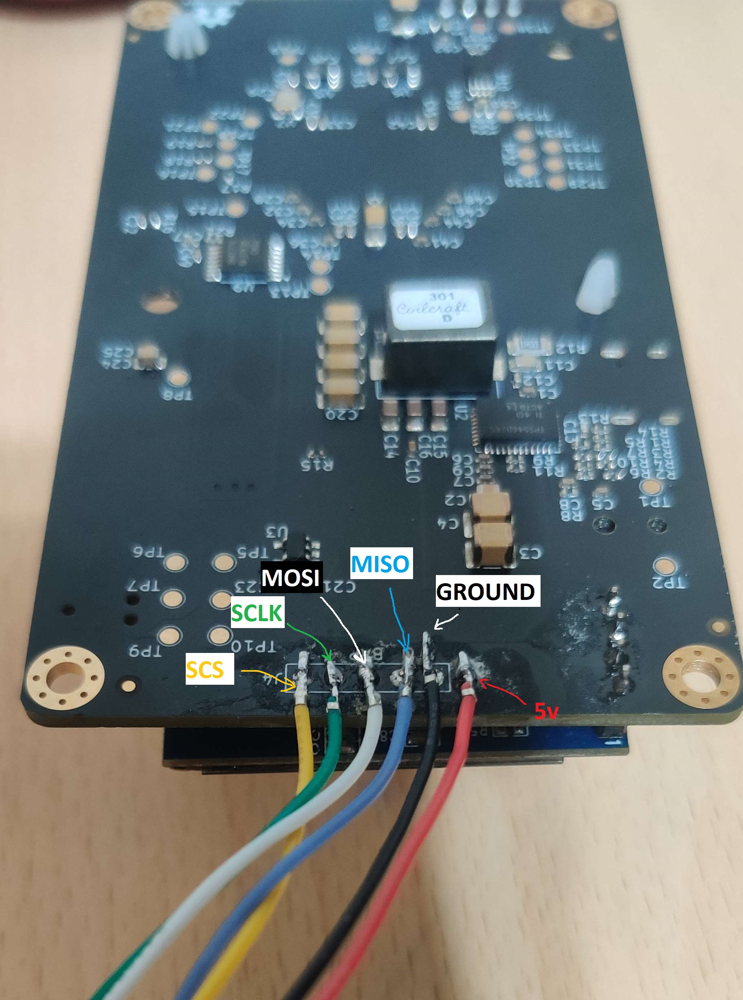

# W5500 Ethernet Module Wiring Guide

This guide provides the pin connections required to add W5500 Ethernet connectivity to your BitAxe miner running the ESP-Miner-LAN firmware.
Written by [CryptoIceMLH](https://github.com/CryptoIceMLH), <a href="https://x.com/MolonLabeVC" target="_blank">@MolonLabeVC</a> on X.

## Table of Contents
- [Overview](#overview)
- [W5500 Module Pinout](#w5500-module-pinout)
- [ESP32-S3 to W5500 Connections](#esp32-s3-to-w5500-connections)
- [BAP UART Pinout](#bap-uart-pinout)
- [Important Notes](#important-notes)
- [Power Requirements](#power-requirements)
- [Configuration](#configuration)

## Overview

The W5500 is a hardwired TCP/IP Ethernet controller that communicates with the ESP32-S3 via SPI interface. This implementation provides a reliable wired network connection as an alternative to WiFi.

## W5500 Module Pinout

The W5500 module requires the following connections:

### W5500 Module Pin Assignment

| W5500 Pin | Signal Name | Description              | Connection      |
|-----------|-------------|--------------------------|-----------------|
| MOSI      | SPI MOSI    | Master Out Slave In      | ESP32 GPIO 40   |
| MISO      | SPI MISO    | Master In Slave Out      | ESP32 GPIO 39   |
| SCLK      | SPI Clock   | SPI Clock Signal         | ESP32 GPIO 41   |
| CS / SCS  | Chip Select | SPI Chip Select          | ESP32 GPIO 42   |
| VCC       | Power       | 5v Power                 | 5V              |
| GND       | Ground      | Ground                   | GND             |


## ESP32-S3 to W5500 Connections

### Complete Wiring Table

| ESP32-S3 GPIO | Function     | W5500 Pin | Wire Color Suggestion|
|---------------|--------------|-----------|----------------------|
| GPIO 40       | SPI MOSI     | MOSI      | WHITE                |
| GPIO 39       | SPI MISO     | MISO      | BLUE                 |
| GPIO 41       | SPI SCLK     | SCLK      | GREEN                |
| GPIO 42       | SPI CS       | CS/SCS    | YELLOW               |
| 5V            | Power        | VCC       | Red                  |
| GND           | Ground       | GND       | Black                |

LOOKING at the PCB from the back and BAP port is at the bottom. working on the rear of the miner.



### SPI Configuration

- **SPI Bus**: HSPI (SPI2)
- **SPI Clock Speed**: 20 MHz
- **SPI Mode**: Mode 0 (CPOL=0, CPHA=0)
- **Communication**: Polling mode (interrupt pin not used)

## BAP UART Pinout

The BitAxe Access Protocol (BAP) uses UART communication on the following pins:

| ESP32-S3 GPIO | Function | Description                    |
|---------------|----------|--------------------------------|
| GPIO 40       | BAP RX   | UART Receive (from BAP device) |
| GPIO 39       | BAP TX   | UART Transmit (to BAP device)  |

**⚠️ IMPORTANT PIN CONFLICT NOTE:**

GPIO 40 and GPIO 39 are shared between:
- W5500 SPI interface (MOSI and MISO)
- BAP UART interface (RX and TX)

**You cannot use both W5500 Ethernet and BAP simultaneously with the current pin configuration.**

If you need both interfaces, you must:
1. Modify the pin assignments in the configuration (see Configuration section)
2. Rebuild the firmware with updated GPIO assignments
3. Update your hardware connections accordingly

## Important Notes

### Pin Conflicts
- GPIO 40 is shared between W5500 MOSI and BAP RX
- GPIO 39 is shared between W5500 MISO and BAP TX
- Choose either Ethernet (W5500) OR BAP - not both with default pins

### Network Mode
The firmware supports two network modes:
- **WiFi Mode**: Traditional wireless connectivity
- **Ethernet Mode**: Wired connection via W5500

The system will automatically detect and use Ethernet if properly configured and connected.

### Connection Quality
- Keep SPI wires as short as possible (ideally under 15cm / 6 inches)
- Use twisted pair wiring for MOSI/MISO and SCLK/CS to reduce interference
- Ensure solid ground connection between ESP32 and W5500
- Route SPI wires away from high-power traces and switching components


## Power Requirements

### W5500 Power Specifications
- **Operating Voltage**: 5V (±5%)
- **Typical Current**: 132mA at 5V (during active Ethernet communication)
- **Peak Current**: 145mA (during PHY auto-negotiation)
- **Standby Current**: ~15mA (when idle)


### Power Calculation
**Total System Current (Ethernet Mode):**
- ESP32-S3: ~200-250mA (typical operation)
- W5500: ~132-145mA (active Ethernet)
- ASIC Mining Chip: (varies by model, 1-5A typical)
- **Total**: Add ~150mA to your existing power budget for Ethernet

## Configuration

### Enabling Ethernet in Firmware

The W5500 Ethernet interface is configured via ESP-IDF's menuconfig system:

```bash
# Open configuration menu
idf.py menuconfig
```

Navigate to: **Component config** → **Ethernet W5500 Configuration**

### Configuration Options

| Option                  | Default | Description                                  |
|-------------------------|---------|----------------------------------------------|
| `W5500_SPI_MOSI`        | 40      | SPI MOSI GPIO pin                           |
| `W5500_SPI_MISO`        | 39      | SPI MISO GPIO pin                           |
| `W5500_SPI_SCLK`        | 41      | SPI Clock GPIO pin                          |
| `W5500_SPI_CS`          | 42      | SPI Chip Select GPIO pin                    |
| `W5500_INT_GPIO`        | -1      | Interrupt GPIO (-1 = polling mode)          |
| `W5500_SPI_CLOCK_MHZ`   | 20      | SPI clock frequency in MHz                  |
| `ENABLE_ETHERNET`       | y       | Enable Ethernet support                     |
| `W5500_USE_DHCP`        | y       | Use DHCP for IP address (recommended)       |

### Changing Pin Assignments

To use different GPIO pins (e.g., to avoid conflict with BAP):

1. Run `idf.py menuconfig`
2. Navigate to **Ethernet W5500 Configuration**
3. Update the GPIO pin numbers
4. Save configuration
5. Rebuild firmware: `idf.py build`
6. Flash updated firmware to device
7. Update your hardware wiring to match new pin assignments

### BAP Configuration

BAP UART pins can also be changed in menuconfig:

Navigate to: **Component config** → **BitAxe Configuration**

| Option          | Default | Description                    |
|-----------------|---------|--------------------------------|
| `GPIO_BAP_RX`   | 40      | BAP UART Receive GPIO          |
| `GPIO_BAP_TX`   | 39      | BAP UART Transmit GPIO         |
| `ENABLE_BAP`    | n       | Enable BAP protocol support    |

## Network Configuration

### DHCP (Recommended)
By default, the W5500 uses DHCP to automatically obtain an IP address from your router. This is the easiest setup method.

### Static IP
To use a static IP address:
1. Disable `W5500_USE_DHCP` in menuconfig
2. The IP address can be configured via the AxeOS web interface
3. Alternatively, modify the Ethernet initialization code in `components/ethernet_w5500/ethernet_w5500.c`

## References 
- **W5500 Datasheet**: https://www.wiznet.io/product-item/w5500/
- **ESP-IDF Ethernet Documentation**: https://docs.espressif.com/projects/esp-idf/en/latest/esp32s3/api-reference/network/esp_eth.html
- **BitAxe Project**: https://github.com/bitaxeorg/bitaxe
- **ORIGINAL ESP-Miner Firmware**: https://github.com/bitaxeorg/ESP-Miner

##
**⚠️ WARNING**: Incorrect wiring can damage your ESP32 and/or W5500 module. Double-check all connections before applying power. When in doubt, consult the data sheets or ask for help in the community Discord. The Author takes NO responsibility.  Use this project content at your OWN RISK! 
